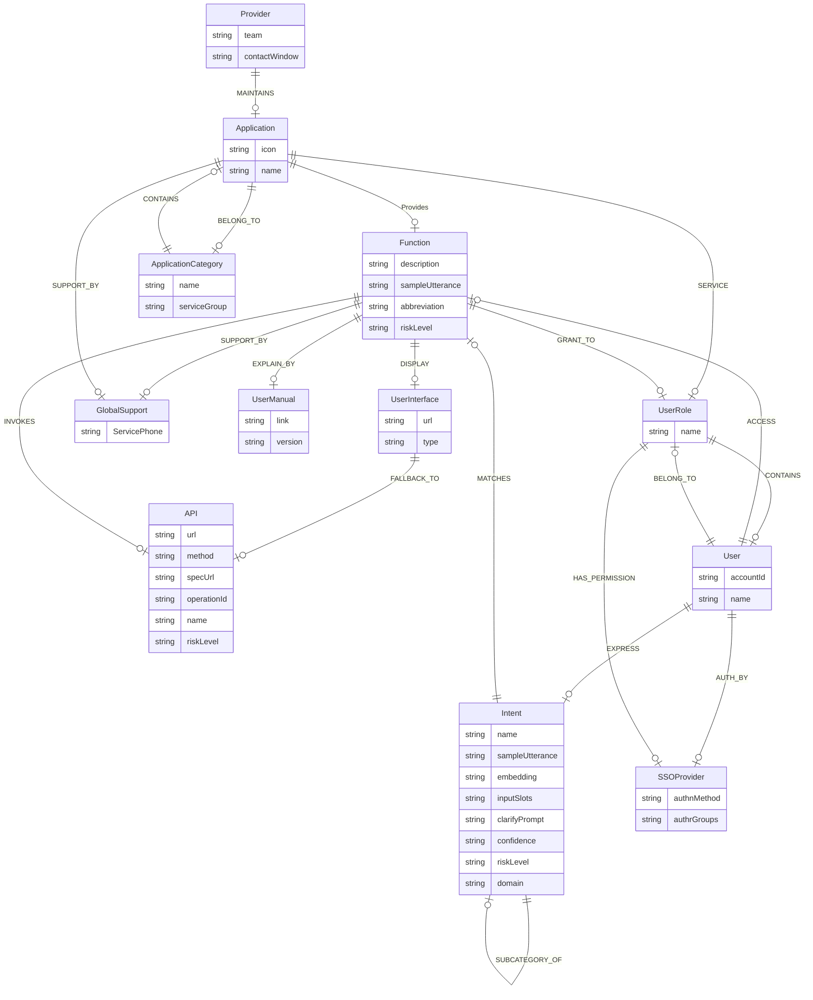

# Ontology Design Confirmation

## 1. Mermaid Ontology Structure


## 2. Properties Definition

> [!TIP]
> **Professional Recommendation**: Added `id` (UUID), `createdAt`, and `updatedAt` to all nodes for data integrity and auditing. Added `isActive` and `status` for lifecycle management.

| Node Label | Property Name | Type | Description |
|---|---|---|---|
| **Common Properties** | id | String | Unique Identifier (UUID). |
| (All Nodes) | createdAt | DateTime | Creation timestamp. |
| | updatedAt | DateTime | Last modification timestamp. |
| | isActive | Boolean | Soft delete / active flag. |
| **UserInterface** | url | String | The URL of the UI page. |
| | type | String | The type of UI (e.g., Web, Mobile). |
| | title | String | Page title for display. |
| **API** | url | String | The endpoint URL of the API. |
| | method | String | HTTP method (GET, POST, PUT, DELETE). |
| | specUrl | String | URL to the API specification (Swagger/OpenAPI). |
| | operationId | String | Unique identifier for the operation in spec. |
| | name | String | Name of the API. |
| | riskLevel | String | Risk level (Low, Medium, High). |
| | timeout | Integer | Timeout in milliseconds. |
| | headers | String/JSON | Required headers (e.g., Auth keys). |
| **Function** | description | String | Detailed description for the LLM to understand purpose. |
| | sampleUtterance | String | Primary sample text. |
| | abbreviation | String | Abbreviation or short code. |
| | riskLevel | String | Risk level. |
| | tags | List<String>| Keywords for hybrid search. |
| **GlobalSupport** | ServicePhone | String | Contact phone number. |
| | email | String | Support email address. |
| **Application** | icon | String | URL or name of the application icon. |
| | name | String | Name of the application. |
| | description | String | Application description for search/LLM. |
| | status | String | Lifecycle status (e.g., 'Production', 'Beta', 'Deprecated'). |
| **UserManual** | link | String | Link to the document. |
| | version | String | Version of the manual. |
| | format | String | Document format (PDF, HTML). |
| **Provider** | team | String | Team name. |
| | contactWindow | String | Contact person info. |
| **ApplicationCategory**| name | String | Name of the category. |
| | serviceGroup | String | Service group hierarchy. |
| **UserRole** | name | String | Name of the role. |
| | description | String | Role description. |
| **User** | accountId | String | Unique identifier (business logic ID). |
| | name | String | Display name. |
| | email | String | User email. |
| | preferences | String/JSON | User UI preferences. |
| **Intent** | name | String | Name of the intent. |
| | sampleUtterance | String | Primary utterance. |
| | trainingPhrases | List<String> | Collection of phrases for model training/few-shot. |
| | embedding | List<Float> | Embedding vector. |
| | inputSlots | String/JSON | Schema of required slots. |
| | clarifyPrompt | String | Prompt to ask for clarification. |
| | confidence | Float | Confidence threshold. |
| | riskLevel | String | Risk level. |
| | domain | String | Domain logic. |
| **SSOProvider** | authnMethod | String | Auth method (OIDC, SAML). |
| | authrGroups | String | Authorization groups mapping. |

## 3. Cypher Create Syntax
```cypher
// Create Nodes with Enhanced Properties
// Note: 'id', 'createdAt', 'updatedAt' are mocked here for illustration. In production, use apoc.create.uuid() or app logic.

CREATE (n1:UserInterface {id: "ui-001", createdAt: datetime(), isActive: true, url: "http://example.com/ui", type: "Web", title: "User Dashboard"})
CREATE (api:API {id: "api-001", createdAt: datetime(), isActive: true, url: "http://api.example.com", method: "GET", specUrl: "http://api.example.com/spec", operationId: "op1", name: "GetInfo", riskLevel: "Low", timeout: 5000})
CREATE (n2:Function:Feature {id: "func-001", createdAt: datetime(), isActive: true, description: "Get User Info", sampleUtterance: "Who am I?", abbreviation: "GetUI", riskLevel: "Low", tags: ["profile", "identity"]})
CREATE (gs:GlobalSupport {id: "gs-001", createdAt: datetime(), isActive: true, ServicePhone: "123-456-7890", email: "support@example.com"})
CREATE (n0:Application {id: "app-001", createdAt: datetime(), isActive: true, icon: "user-icon.png", name: "UserApp", description: "Main application for user self-service", status: "Production"})
CREATE (um:UserManual:Document:Faq {id: "doc-001", createdAt: datetime(), isActive: true, link: "http://docs.example.com", version: "1.0", format: "HTML"})
CREATE (prov:Provider {id: "prov-001", createdAt: datetime(), isActive: true, team: "CoreTeam", contactWindow: "admin@example.com"})
CREATE (cat:ApplicationCategory:UserDomain {id: "cat-001", createdAt: datetime(), isActive: true, name: "Productivity", serviceGroup: "General"})
CREATE (n12:UserGroup:Role {id: "role-001", createdAt: datetime(), isActive: true, name: "Employee", description: "Standard employee role"})
CREATE (n3:User {id: "user-001", createdAt: datetime(), isActive: true, accountId: "u123", name: "Alice", email: "alice@example.com", preferences: "{}"})
CREATE (n11:Intent {id: "intent-001", createdAt: datetime(), isActive: true, name: "CheckIdentity", sampleUtterance: "Who am I?", trainingPhrases: ["Who am I?", "Show my profile", "My info"], embedding: [], inputSlots: "{}", clarifyPrompt: "", confidence: 0.9, riskLevel: "Low", domain: "SelfService"})
CREATE (auth:SSOProvider:`A4Auth` {id: "auth-001", createdAt: datetime(), isActive: true, authnMethod: "OIDC", authrGroups: "All"})

// Create Relationships (No changes to topology, only nodes enhanced)
CREATE (n1)<-[:FALLBACK_TO]-(api)
CREATE (api)<-[:INVOKES]-(n2)
CREATE (n2)-[:SUPPORT_BY]->(gs)
CREATE (n0)-[:Provides]->(n2)
CREATE (n0)-[:SUPPORT_BY]->(gs)
CREATE (n2)-[:EXPLAIN_BY]->(um)
CREATE (prov)-[:MAINTAINS]->(n0)
CREATE (cat)-[:CONTAINS]->(n0)
CREATE (n0)-[:BELONG_TO]->(cat)
CREATE (n0)-[:SERVICE]->(n12)
CREATE (n3)-[:ACCESS]->(n2)
CREATE (n11)-[:MATCHES]->(n2)
CREATE (n3)-[:EXPRESS]->(n11)
CREATE (n3)-[:AUTH_BY]->(auth)
CREATE (n12)-[:HAS_PERMISSION]->(auth)
CREATE (n2)-[:GRANT_TO]->(n12)
CREATE (n2)-[:DISPLAY]->(n1)
CREATE (n3)-[:BELONG_TO]->(n12)
CREATE (n12)-[:CONTAINS]->(n3)
CREATE (n11)-[:SUBCATEGORY_OF]->(n11)
```

## 4. Performance & Indexes
> [!IMPORTANT]
> **Performance Optimization**: To ensure sub-millisecond query performance and support vector search.

### 4.1 Constraints (Data Integrity & Fast Lookups)
Constraints implicitly create a unique index, which is the fastest way to look up nodes.
```cypher
// Ensure unique IDs for all major nodes
CREATE CONSTRAINT user_id IF NOT EXISTS FOR (u:User) REQUIRE u.id IS UNIQUE;
CREATE CONSTRAINT app_id IF NOT EXISTS FOR (a:Application) REQUIRE a.id IS UNIQUE;
CREATE CONSTRAINT func_id IF NOT EXISTS FOR (f:Function) REQUIRE f.id IS UNIQUE;
CREATE CONSTRAINT intent_id IF NOT EXISTS FOR (i:Intent) REQUIRE i.id IS UNIQUE;
CREATE CONSTRAINT api_id IF NOT EXISTS FOR (api:API) REQUIRE api.id IS UNIQUE;

// Business Logic Uniqueness
CREATE CONSTRAINT user_account IF NOT EXISTS FOR (u:User) REQUIRE u.accountId IS UNIQUE;
CREATE CONSTRAINT intent_name IF NOT EXISTS FOR (i:Intent) REQUIRE i.name IS UNIQUE;
```

### 4.2 Indexes (Fast Filtering & Search)
Create indexes on properties often used in `WHERE` or `ORDER BY` clauses.
```cypher
// Search by names/status
CREATE INDEX app_name IF NOT EXISTS FOR (a:Application) ON (a.name);
CREATE INDEX func_name IF NOT EXISTS FOR (f:Function) ON (f.name);
CREATE INDEX intent_name_idx IF NOT EXISTS FOR (i:Intent) ON (i.name);

// Status filtering (e.g. "Show only active apps")
CREATE INDEX app_status IF NOT EXISTS FOR (a:Application) ON (a.status);
CREATE INDEX func_active IF NOT EXISTS FOR (f:Function) ON (f.isActive);
```

### 4.3 Vector Index (For AI Semantic Search)
Required for fast similarity search on `Intent` embeddings.
```cypher
// Create Vector Index for Intent Embeddings
// Dimension: 1536 (Standard OpenAI embedding size, adjust if using different model)
// Similarity: cosine
CREATE VECTOR INDEX intent_embedding_index IF NOT EXISTS
FOR (i:Intent)
ON (i.embedding)
OPTIONS {indexConfig: {
 `vector.dimensions`: 1536,
 `vector.similarity_function`: 'cosine'
}};
```
